- [`project.nvim`](https://github.com/DrKJeff16/project.nvim): My improved and actively maintained version of [ahmedkhalf/project.nvim](https://github.com/ahmedkhalf/project.nvim).
- [`wezterm-types`](https://github.com/DrKJeff16/wezterm-types): LuaLS type annotations for [`WezTerm`](https://github.com/wezterm/wezterm) configuration.
- [`which-colorscheme.nvim`](https://github.com/DrKJeff16/which-colorscheme.nvim) - Cycle between colorschemes using autogenerated `which-key.nvim` bindings.
- [`Jnvim`](https://github.com/DrKJeff16/nvim): My personal Neovim configuration.
- [`nvim-plugin-boilerplate`](https://github.com/DrKJeff16/nvim-plugin-boilerplate): Documented Neovim plugin template
  with a dynamic setup script and multiple integrations.
- [`vim-eof-comment`](https://github.com/DrKJeff16/vim-eof-comment): Python script to add Vim modeline comments
at the end of file of every file with a given extension.
- [`rockerBOO/awesome-neovim`](https://github.com/rockerBOO/awesome-neovim): Collections of awesome Neovim plugins **(COLLABORATOR)**.
- [`gisketch/triforce.nvim`](https://github.com/gisketch/triforce.nvim): Gamification for Neovim **(COLLABORATOR)**.

---

## About Me

I love Linux (_I use Arch, btw_), open-source software and Neovim.

Helping around as much as I can and **documenting code** are among my main objectives.
