  

 

---

<a href="#">
  <picture>
    <source media="(prefers-color-scheme: dark)" srcset="./profile/stats_dark.svg" />
    <source media="(prefers-color-scheme: light)" srcset="./profile/stats_default.svg" />
    
  </picture>
</a>
<a href="#">
  <picture>
    <source media="(prefers-color-scheme: dark)" srcset="./profile/top-langs_dark.svg" />
    <source media="(prefers-color-scheme: light)" srcset="./profile/top-langs_default.svg" />
    
  </picture>
</a>
 

---

  <a href="https://github.com/DrKJeff16/project.nvim">
    <picture>
      <source media="(prefers-color-scheme: dark)" srcset="./profile/project_nvim.pin_dark.svg" />
      <source media="(prefers-color-scheme: light)" srcset="./profile/project_nvim.pin_default.svg" />
      
    </picture>
  </a>
   
  <em>My improved and actively maintained version of <a href="https://github.com/ahmedkhalf/project.nvim"><code>ahmedkhalf/project.nvim</code></a>.</em>
   
   
  <a href="https://github.com/DrKJeff16/wezterm-types">
    <picture>
      <source media="(prefers-color-scheme: dark)" srcset="./profile/wezterm-types.pin_dark.svg" />
      <source media="(prefers-color-scheme: light)" srcset="./profile/wezterm-types.pin_default.svg" />
      
    </picture>
  </a>
   
  <em>LuaLS type annotations for your <a href="https://github.com/wezterm/wezterm"><code>WezTerm</code></a> configuration.</em>
   
   
  <a href="https://github.com/DrKJeff16/nvim">
    <picture>
      <source media="(prefers-color-scheme: dark)" srcset="./profile/Jnvim.pin_dark.svg" />
      <source media="(prefers-color-scheme: light)" srcset="./profile/Jnvim.pin_default.svg" />
      
    </picture>
  </a>
   
  <em>My personal Neovim configuration.</em>
   
   
  <a href="https://github.com/DrKJeff16/pipenv.nvim">
    <picture>
      <source media="(prefers-color-scheme: dark)" srcset="./profile/pipenv-nvim.pin_dark.svg" />
      <source media="(prefers-color-scheme: light)" srcset="./profile/pipenv-nvim.pin_default.svg" />
      
    </picture>
  </a>
   
  <em>Manage Pipenv from within Neovim.</em>
   
   
  <a href="https://github.com/DrKJeff16/which-colorscheme.nvim">
    <picture>
      <source media="(prefers-color-scheme: dark)" srcset="./profile/which-colorscheme.pin_dark.svg" />
      <source media="(prefers-color-scheme: light)" srcset="./profile/which-colorscheme.pin_default.svg" />
      
    </picture>
  </a>
   
  <em>Cycle between colorschemes using <a href="https://github.com/folke/which-key.nnim"><code>which-key.nvim</code></a> bindings.</em>
   
   
  <a href="https://github.com/DrKJeff16/vim-eof-comment">
    <picture>
      <source media="(prefers-color-scheme: dark)" srcset="./profile/vim-eof-comment.pin_dark.svg" />
      <source media="(prefers-color-scheme: light)" srcset="./profile/vim-eof-comment.pin_default.svg" />
      
    </picture>
  </a>
   
  <em>Python script to add Vim modeline comments at the end of every file with a given file extension.</em>
   
   
  <a href="https://github.com/DrKJeff16/nvim-plugin-boilerplate">
    <picture>
      <source media="(prefers-color-scheme: dark)" srcset="./profile/nvim-plugin-boilerplate.pin_dark.svg" />
      <source media="(prefers-color-scheme: light)" srcset="./profile/nvim-plugin-boilerplate.pin_default.svg" />
      
    </picture>
  </a>
   
  <em>Documented Neovim plugin templatewith  a dynamic setup script and multiple integrations.</em>
   
   
  <a href="https://github.com/gisketch/triforce.nvim">
    <picture>
      <source media="(prefers-color-scheme: dark)" srcset="./profile/triforce.pin_dark.svg" />
      <source media="(prefers-color-scheme: light)" srcset="./profile/triforce.pin_default.svg" />
      
    </picture>
  </a>
   
  <em>Gamification for Neovim <b><ins>(COLLABORATOR)</ins></b>.</em>
   
   
  <a href="https://github.com/rockerBOO/awesome-neovim">
    <picture>
      <source media="(prefers-color-scheme: dark)" srcset="./profile/awesome-neovim.pin_dark.svg" />
      <source media="(prefers-color-scheme: light)" srcset="./profile/awesome-neovim.pin_default.svg" />
      
    </picture>
  </a>
   
  <em>Collections of awesome Neovim plugins <b><ins>(COLLABORATOR)</ins></b>.</em>

---

## About Me

I love Linux (_I use Arch, btw_), open-source software and Neovim.

Helping around as much as I can and **documenting code** are among my main objectives.

<!-- vim: set ts=2 sts=2 sw=2 et ai si sta: -->
