|                                |  |
|----------------------------------------------------------------------------------------------------------------------------|-------------------------------------------------------------------------------------------------|
| My improved and actively maintained version of [ahmedkhalf/project.nvim](https://github.com/ahmedkhalf/project.nvim). | LuaLS type annotations for[`WezTerm`](https://github.com/wezterm/wezterm) configuration.   |

|  |  |
|------------------------------------------------------------------------|-----------------------------------------------------------------------------------------------------------------------|
| My personal Neovim configuration.                                      | Cycle between colorschemes using autogenerated `which-key.nvim` bindings.                                        |

|  |  |
|-------------------------------------------------------------------------------------------------------------------------------|-------------------------------------------------------------------------------------------------------|
| Documented Neovim plugin templatewith  a dynamic setup script and multiple integrations.                            | Python script to add Vim modeline comments at the end of every file with a given extension. |

|  |     |
|-------------------------------------------------------------------------------------------|-------------------------------------------------------------------------------------------------------|
| Gamification for Neovim  **(COLLABORATOR)**.                                         | Collections of awesome Neovim plugins  **(COLLABORATOR)**.                                        |

---

## About Me

I love Linux (_I use Arch, btw_), open-source software and Neovim.

Helping around as much as I can and **documenting code** are among my main objectives.
